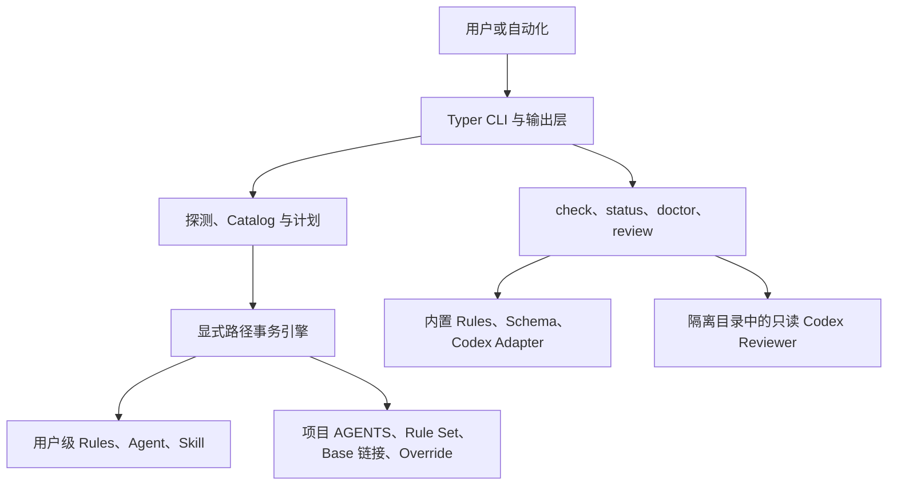
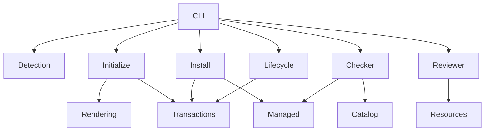
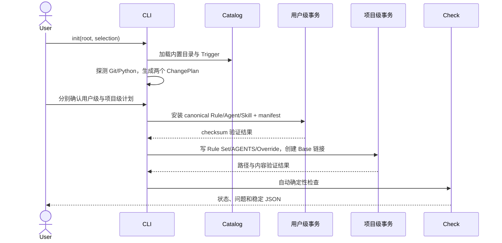
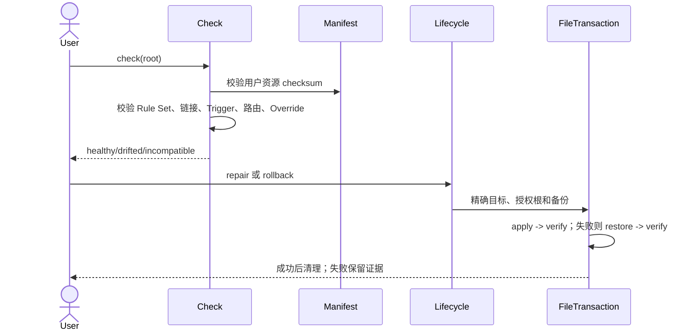
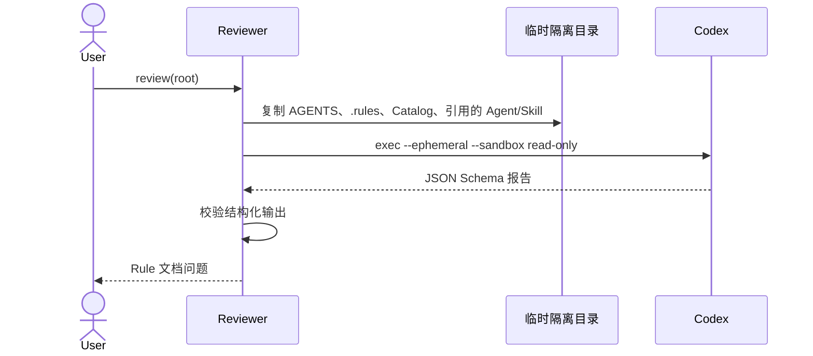

# CODEMAPS — 模块关系地图

> 三层文档体系：`AGENTS.md`（会话上下文）→ 本文档（跨模块架构）→
> `src/project_execution_rules/AGENTS.md`（包内导航）。本文只描述关系、数据流和边界。

## 1. 架构层级图

`cli.py` 只负责编排和交互；确定性判断在探测、检查和生命周期模块中；所有持久化
修改最终必须经过 `FileTransaction`，Reviewer 只能接触复制到临时隔离目录的治理
文件。

## 2. 模块依赖矩阵

| 模块组 | 主要文件 | 允许依赖 | 不负责 |
|---|---|---|---|
| CLI/输出 | `cli.py`、`presentation.py` | 所有服务层入口 | 直接写托管文件 |
| 领域模型 | `models.py`、`errors.py`、`paths.py` | 标准库 | 产品流程 |
| Catalog/语法 | `catalog.py`、`frontmatter.py`、`yaml_utils.py` | models、resources | 项目业务代码 |
| 项目规划 | `detection.py`、`rendering.py`、`initialize.py` | Catalog、事务 | 执行项目命令 |
| 用户资源 | `install.py`、`managed.py` | resources、事务 | 项目 Rule Set |
| 检查诊断 | `checker.py`、`status.py`、`doctor.py` | Catalog、manifest | 修复或测试项目 |
| 生命周期 | `lifecycle.py` | install、rendering、事务 | 合并用户/项目授权 |
| Reviewer | `reviewer.py` | Schema、Codex CLI | 读取隔离目录外文件 |
| 事务 | `transactions.py` | errors | 递归删除、模糊目标 |

## 3. 端到端数据流

### 3.1 install 与 init

用户级与项目级事务不得共享授权根、确认或回滚。初始化前先验证 Windows 符号链接
能力；不具备权限时不得复制 Base Rule 作为降级。

### 3.2 check、repair 与 rollback

### 3.3 Rules review

业务源码、测试配置、`.env`、日志和外部服务都不进入隔离目录。

## 4. 架构不变量与边界规则

- `src/`、测试、项目元数据、锁文件和实际 CLI 行为是实现事实来源。
- Base Rule 是用户级 canonical 文件到项目 `.rules/` 的符号链接；Override 是项目
  普通文件，默认保留。
- 所有写入目标必须先做词法根校验，再解析父链真实落点；备份、应用、恢复和手动
  rollback 都重复校验并复验结果。
- manifest 只保存 logical path、版本和 checksum，不保存凭据或文件正文。
- 用户级与项目级资源使用独立计划、确认、事务和回滚。
- JSON 修改命令必须显式 `--yes`，dry-run 除外；单次命令只输出一个 JSON 对象。
- `check` 和 `doctor` 不运行项目质量命令；`review` 只审查治理文件。
- `.codex/config.toml` 只检查存在性，不读取后重写。
- 不执行 Rule Markdown 中出现的命令，不读取或修改业务代码。

## 5. 关键术语表

| 术语 | 含义 | 涉及模块 |
|---|---|---|
| Base Rule | CLI 内置并安装到用户目录的 canonical Rule | catalog、install、initialize |
| Override | 仅保存真实项目差异的项目普通文件 | rendering、checker |
| Rule Set | `.rules/ruleset.yaml` 中的项目期望状态 | initialize、status、lifecycle |
| Catalog | Rule 域、Profile、Trigger 和资源版本目录 | catalog、resources |
| Trigger | `always`、`paths`、`task`、`explicit` 激活语义 | catalog、rendering、checker |
| managed manifest | 用户托管文件的 logical path 和 SHA-256 | managed、install、checker |
| ChangePlan | 修改前可序列化预览的精确目标集合 | models、各生命周期服务 |
| FileTransaction | 备份、应用、复验、恢复和证据保留引擎 | transactions |
| Rules Reviewer | 运行在隔离目录中的只读 Codex 审查 | reviewer、adapter resources |

## 6. 常见任务入口速查

| 任务类型 | 起点文件 | 相关文档 |
|---|---|---|
| 新增 CLI 参数或命令 | `src/project_execution_rules/cli.py` | `README.md` |
| 新增 Rule 域或 Trigger | `src/project_execution_rules/resources/catalog.yaml` | 首版设计第 7–9 节 |
| 修改用户级安装资源 | `src/project_execution_rules/install.py` | `managed.py` |
| 修改项目初始化 | `src/project_execution_rules/initialize.py` | `rendering.py` |
| 增加确定性检查 | `src/project_execution_rules/checker.py` | `status.py` |
| 修改 update/repair/uninstall/rollback | `src/project_execution_rules/lifecycle.py` | `transactions.py` |
| 加固路径或恢复 | `src/project_execution_rules/transactions.py` | `tests/test_transactions.py` |
| 修改 Reviewer 输入边界 | `src/project_execution_rules/reviewer.py` | `resources/schemas/` |
| 修改 Codex 显式入口 | `src/project_execution_rules/resources/adapters/codex/` | `rendering.py` |
| 执行完整验收 | `pyproject.toml` | 实施计划 Phase 9 |
